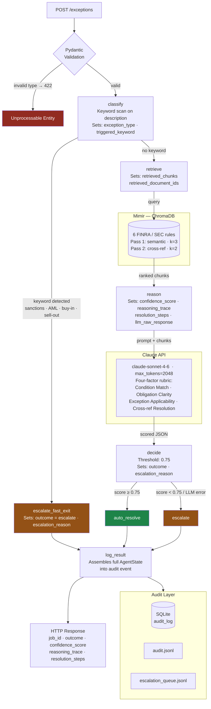

# Huginn

Huginn is a LangGraph-based AI agent that classifies financial trade exceptions and decides whether to auto-resolve them or escalate to a human reviewer. It was built design-first: the interface contract, architecture, and locked decision log all preceded the implementation. That sequence is the primary signal this repository is meant to convey.

---

## The Project Arc

| Version | What it is | What it advances |
|---|---|---|
| [**Huginn v1**](huginn_v1/README.md) | Full agentic pipeline — FastAPI, LangGraph, ChromaDB, Claude API, audit log | Proof of methodology. Three-path state machine, human-in-the-loop escalation, full-fidelity audit trail. Knowledge base is synthetic SOPs. |
| [**Huginn v2**](huginn_v2/README.md) | Rebuilt from a new masterplan against the same interface contract | Reasoning architecture upgrade. Synthetic SOPs replaced with six real FINRA and SEC regulatory documents. Scoring rubric rebuilt around the four cognitive tasks required to apply legal text. |
| [**Huginn v2 Demo**](huginn_v2_demo/README.md) | Interactive single-page demo — no local setup required | Live Claude API call via Cloudflare Worker. Five pre-built scenarios covering all three execution paths. Animated LangGraph state diagram. **[Open demo →](https://rlin25.github.io/HuginnsMessage/)** |

---

## Architecture

Huginn v2 control flow — from API ingress through the LangGraph state machine to the audit layer.

---

## The Methodology

Every version followed the same six-phase sequence: domain learning, Socratic design, interface contract, masterplan, implementation, feedback loop. Phases one through four happened before Claude Code wrote a line of code. Claude acted as a design partner — pressing on reasoning, surfacing gaps, formalizing decisions. Every architectural judgment was the developer's.

The design artifacts — interface contracts, locked decision logs, masterplans — are version-stable. The code is intentionally disposable. V2 was regenerated from scratch against an updated masterplan. The documents carry intent across versions. The code does not.

The `prompts/` directory in each sub-project contains the structured prompts that governed the AI collaboration at each phase.
