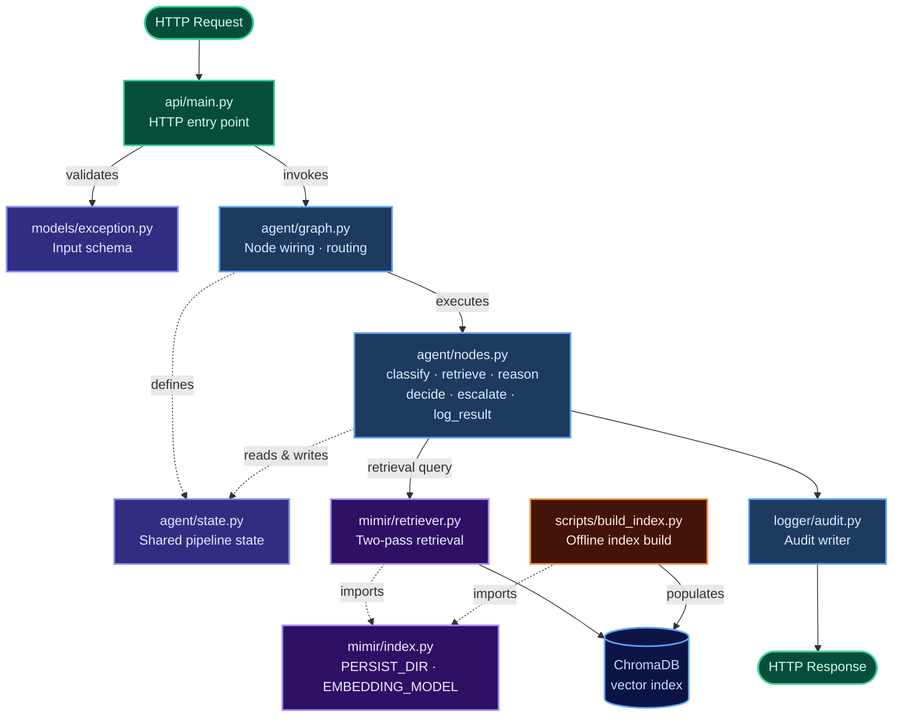

# Huginn v2 — Code Walkthrough

Nine files. Browse the directory above to open any walkthrough.

Solid arrows are runtime execution flow. Dotted arrows are import/structural dependencies. `scripts/build_index.py` runs offline once before the server starts.
